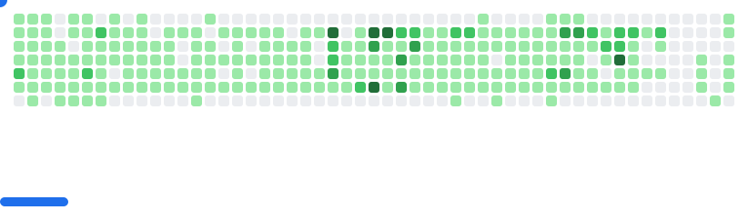

### Hi there I'm Jairo Bernardo B Rauwers, but you can call me Jiro
</img>
##

- 🔭 I’m currently working with Nextjs, Typescript ...
- 🌱 I’m currently studing Computer Science
- 📫 How to reach me: jairorauwers@gmail.com // IG: @jairorauwers
- 😄 Pronouns: he/him
- ⚡ Fun fact: OwO 

<!-- 

   -->
<!--     -->

  <picture>
    <source
      media="(prefers-color-scheme: dark)"
      srcset="images/breakout-dark.svg"
    />
    <source
      media="(prefers-color-scheme: light)"
      srcset="images/breakout-light.svg"
    />
    
  </picture>

 
 ##
